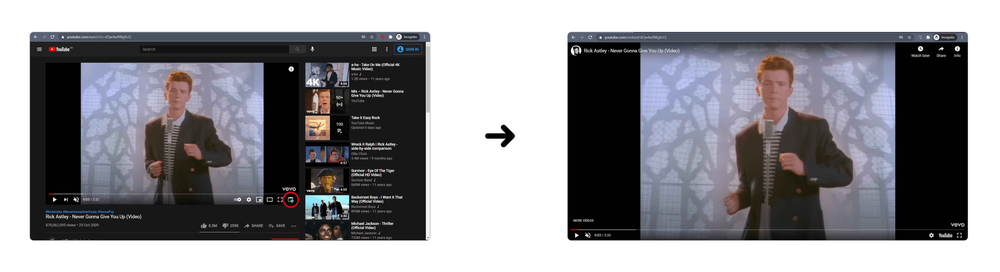

# Fullwindow YouTube

A Chrome extension to make any YouTube video full-window in a click. Uses embed links.

 <!-- Icons from https://icons8.com -->

 

## Extension Setup

- Clone this repository.
- Navigate to `chrome://extensions/` or equivalent, from settings of a chromium browser.
- Turn **ON** the developer mode toggle on the top right.
- Click on **Load unpacked** and select the **contents**.
- Navigate to any YouTube video and click the button on the bottom-right.
